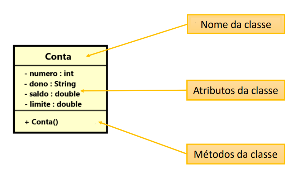
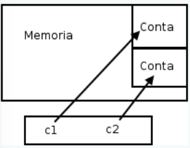

# POO com Java

Este documento aborda os principais conceitos de Programação Orientada a Objetos (POO) utilizando Java. Nele, você encontrará desde os fundamentos e paradigmas que orientam o desenvolvimento até tópicos avançados, como encapsulamento, construtores, métodos e atributos estáticos. Cada seção contém exemplos práticos e explicações detalhadas para auxiliar tanto iniciantes quanto desenvolvedores que buscam refinar seus conhecimentos na linguagem.

---

## Introdução à Programação Orientada a Objetos

Antes de mergulharmos nos conceitos específicos de Java, é importante compreender o contexto e os fundamentos que embasam a Programação Orientada a Objetos.

### 1. Paradigma de Programação

Um **paradigma de programação** é um modelo que descreve como resolver problemas e estruturar programas. Ele funciona como uma “filosofia” que orienta a forma de pensar e programar. Alguns paradigmas comuns incluem:

- **Procedural:**  
  Foca em uma sequência de instruções ou comandos que o computador deve executar. Exemplos: C, Pascal.
- **Orientada a Objetos (POO):**  
  Organiza o código em objetos que combinam dados e comportamentos. Exemplos: Java, C++, Python.
- **Funcional:**  
  Trata a computação como a avaliação de funções matemáticas, evitando mudanças de estado e dados mutáveis. Exemplos: Haskell, Lisp.
- **Lógico:**  
  Baseia-se em lógica formal e regras para derivar conclusões. Exemplo: Prolog.
- **Declarativo:**  
  Especifica o que o programa deve fazer, sem detalhar como fazê-lo, focando no resultado desejado. Exemplos: SQL, HTML.

### 0.2 Fundamentos de POO

A **Programação Orientada a Objetos** organiza o código em torno de *objetos*, que representam entidades do mundo real ou conceitos abstratos. Essa abordagem torna o desenvolvimento mais intuitivo e modular, pois cada objeto possui um estado (dados) e comportamentos (métodos) próprios.

### 0.3 Por que Usar POO?

Utilizar POO oferece diversos benefícios:

- **Legibilidade:**  
  O código fica organizado em “blocos” que representam entidades reais, facilitando o entendimento.
- **Reusabilidade:**  
  Classes podem ser reutilizadas em diferentes partes do sistema ou mesmo em outros projetos.
- **Manutenção:**  
  Alterações são centralizadas dentro das classes, facilitando a correção de erros e a expansão do sistema.

*Exemplo – Cálculo de Área de Triângulos:*  
Na abordagem procedural, seria necessário trabalhar com várias variáveis separadas para cada lado de cada triângulo. Com POO, cria-se uma classe `Triangle` que agrupa os três lados como atributos e pode incluir métodos para calcular a área ou validar os lados. Assim, cada objeto `Triangle` representa um triângulo específico, reduzindo a quantidade de variáveis e organizando melhor o código.

### 0.4 Abstração

A **abstração** é um dos pilares da POO e consiste em representar um objeto com apenas as informações essenciais para o contexto do sistema, ignorando detalhes desnecessários.  
  
*Exemplo – Modelo de um Carro:*  
- **Abstração Visual:**  
  Atributos como cor, modelo e forma podem ser usados para representar a aparência do carro.  
- **Abstração Funcional:**  
  Detalhes mecânicos, como o sistema de embreagem e freios, podem ser destacados se o foco for o desempenho e a funcionalidade.

Ao escolher quais aspectos modelar, os atributos e métodos da classe podem variar conforme o nível de detalhe desejado. Essa abordagem reduz a complexidade e facilita a manutenção e o reuso do código.

### 0.5 Instância e Instanciação

- **Instância:**  
  É a criação de um objeto a partir de uma classe. Por exemplo, se a classe `Carro` é o molde, uma instância seria um *Ferrari vermelho 2024* – um carro específico criado a partir desse molde.
  
- **Instanciação:**  
  É o processo de criação de um objeto, que envolve a alocação dinâmica de memória (na *Heap*) utilizando o operador `new` em Java. A variável que recebe o objeto (armazenada na *Stack*) contém uma referência (endereço de memória) para o objeto criado.

*Exemplo:*

```java
Triangle x, y; // Variáveis de referência na Stack
x = new Triangle(); // Instanciação: um objeto Triangle é criado na Heap e x armazena seu endereço
```

A distinção entre a variável de referência (na Stack) e o objeto real (na Heap) é fundamental para compreender como o Java gerencia a memória.

---

## Sumário

1. [Conceitos Iniciais](#1-conceitos-iniciais)  
   1.1 [Classes e Objetos](#11-classes-e-objetos)  
   1.2 [Projeto de Classes com UML](#12-projeto-de-classes-com-uml)  
2. [Definindo Classes](#2-definindo-classes)  
   2.1 [Atributos](#21-atributos)  
   2.2 [Criando Objetos](#22-criando-objetos)  
   2.3 [Acessando e Modificando Atributos](#23-acessando-e-modificando-atributos)  
3. [Membros Estáticos](#3-membros-estáticos)  
   3.1 [Atributos e Métodos Estáticos](#31-atributos-e-métodos-estáticos)  
   3.2 [Comparação com Membros Não Estáticos](#32-comparação-com-membros-não-estáticos)  
   3.3 [Melhores Práticas](#33-melhores-práticas)  
4. [Métodos](#4-métodos)  
   4.1 [Definindo Métodos](#41-definindo-métodos)  
   4.2 [Métodos com Retorno](#42-métodos-com-retorno)  
   4.3 [O Método transfere](#43-o-método-transfere)  
5. [Referências em Java](#5-referências-em-java)  
   5.1 [Como Referências Funcionam](#51-como-referências-funcionam)  
   5.2 [Comparando Objetos com ==](#52-comparando-objetos-com--)  
6. [Exemplos de Código](#6-exemplos-de-código)  
   6.1 [Classe Conta](#61-classe-conta)  
   6.2 [Teste de Métodos](#62-teste-de-métodos)  
7. [Atributos](#7-atributos)  
   7.1 [Valores Padrão](#71-valores-padrão)  
   7.2 [Composição de Classes](#72-composição-de-classes)  
   7.3 [Referências e null](#73-referências-e-null)  
8. [Palavra-chave this](#8-palavra-chave-this)  
   8.1 [Diferenciando Atributos de Variáveis Locais](#81-diferenciando-atributos-de-variáveis-locais)  
   8.2 [Passando o Próprio Objeto como Argumento](#82-passando-o-próprio-objeto-como-argumento)  
9. [Controlando o Acesso](#9-controlando-o-acesso)  
   9.1 [Problemas com Acesso Direto a Atributos](#91-problemas-com-acesso-direto-a-atributos)  
   9.2 [Encapsulamento para Proteger os Dados](#92-encapsulamento-para-proteger-os-dados)  
10. [Encapsulamento e Modificadores de Acesso](#10-encapsulamento-e-modificadores-de-acesso)  
    10.1 [Benefícios do Encapsulamento](#101-benefícios-do-encapsulamento)  
    10.2 [Interface vs. Implementação](#102-interface-vs-implementação)  
    10.3 [Modificadores de Acesso Detalhados](#103-modificadores-de-acesso-detalhados)  
11. [Exemplo Prático: Validação de CPF](#11-exemplo-prático-validação-de-cpf)  
12. [Getters e Setters](#12-getters-e-setters)  
    12.1 [Problema do Acesso Direto](#121-problema-do-acesso-direto)  
    12.2 [O Papel dos Getters e Setters](#122-o-papel-dos-getters-e-setters)  
    12.3 [Personalizando Getters](#123-personalizando-getters)  
13. [Construtores](#13-construtores)  
    13.1 [O Que é um Construtor?](#131-o-que-é-um-construtor)  
    13.2 [Construtor Default](#132-construtor-default)  
    13.3 [Construtores com Argumentos](#133-construtores-com-argumentos)  
    13.4 [Sobrecarga de Construtores](#134-sobrecarga-de-construtores)  
    13.5 [Chamando Outro Construtor com this()](#135-chamando-outro-construtor-com-this)  
14. [Resumo e Benefícios](#14-resumo-e-benefícios)  
15. [Introdução aos Atributos de Classe](#15-introdução-aos-atributos-de-classe)  
16. [Atributos Estáticos com static](#16-atributos-estáticos-com-static)  
    16.1 [Definição de Atributos Estáticos](#161-definição-de-atributos-estáticos)  
    16.2 [Acesso e Uso de Atributos Estáticos](#162-acesso-e-uso-de-atributos-estáticos)  
17. [Métodos Estáticos](#17-métodos-estáticos)  
    17.1 [Características dos Métodos Estáticos](#171-características-dos-métodos-estáticos)  
    17.2 [Comparação: Métodos Estáticos vs. Métodos de Instância](#172-comparação-métodos-estáticos-vs-métodos-de-instância)  
18. [Exemplo Prático: Controle de Contas Bancárias](#18-exemplo-prático-controle-de-contas-bancárias)  
19. [Resumo e Benefícios](#19-resumo-e-benefícios)  

---

## 1. Conceitos Iniciais

### 1.1 Classes e Objetos

- **Classe:**  
  Define a estrutura e o comportamento de um objeto. Pode ser vista como uma “planta” que especifica os atributos (dados) e métodos (comportamentos) que os objetos terão.

- **Objeto:**  
  É uma instância concreta da classe, criada em tempo de execução. Cada objeto possui seu próprio estado e pode executar os comportamentos definidos na classe.

### 1.2 Projeto de Classes com UML

UML (*Unified Modeling Language*) é uma linguagem visual para modelar sistemas de software. Ela permite representar classes, atributos, métodos, relacionamentos e interações, facilitando o design e a compreensão do sistema antes da implementação.

*Exemplo – Diagrama UML da classe Conta:*  
- **Atributos:** `numero`, `dono`, `saldo`, `limite`  
- **Visibilidade:**  
  - `-` indica privado (acesso restrito).  
  - `+` indica público (acesso externo).



---

## 2. Definindo Classes

### 2.1 Atributos

Atributos são as variáveis que definem as características e o estado de um objeto.

```java
class Conta {
    int numero;
    String dono;
    double saldo;
    double limite;
}
```

### 2.2 Criando Objetos

Para criar (instanciar) um objeto, utilizamos o operador `new`.

```java
Conta minhaConta = new Conta();
```

### 2.3 Acessando e Modificando Atributos

Após criar o objeto, seus atributos podem ser acessados e modificados.

```java
minhaConta.dono = "Duke";
minhaConta.saldo = 1000.0;
System.out.println(minhaConta.saldo);
```

---

## 3. Membros Estáticos

### 3.1 Atributos e Métodos Estáticos

Membros estáticos pertencem à classe e não a instâncias individuais. São úteis para constantes e métodos utilitários.

```java
public static final double PI = 3.14159;
public static double circunference(double radius) {
    return 2.0 * PI * radius;
}
```

Chamada de método estático:

```java
double circ = Calculator.circunference(3.0);
```

### 3.2 Comparação com Membros Não Estáticos

- **Estáticos:** São compartilhados entre todas as instâncias e não acessam `this`.
- **Não Estáticos:** Pertencem a cada objeto individualmente.

### 3.3 Melhores Práticas

- Use membros estáticos para constantes e métodos que não dependem do estado do objeto.  
- Evite redundância criando membros de instância para valores fixos.

---

## 4. Métodos

### 4.1 Definindo Métodos

Métodos representam comportamentos de um objeto.

```java
void saca(double quantidade) {
    this.saldo -= quantidade;
}
```

### 4.2 Métodos com Retorno

Métodos podem retornar valores para indicar resultados ou estados.

```java
boolean saca(double valor) {
    if (this.saldo < valor) {
        return false;
    }
    this.saldo -= valor;
    return true;
}
```

### 4.3 O Método transfere

Método que utiliza outros métodos (como `saca` e `deposita`) para realizar operações complexas.

```java
boolean transfere(Conta destino, double valor) {
    if (this.saca(valor)) {
        destino.deposita(valor);
        return true;
    }
    return false;
}
```

---

## 5. Referências em Java

### 5.1 Como Referências Funcionam

Em Java, variáveis de objeto armazenam referências (endereços) para objetos na memória.

```java
Conta c1 = new Conta();
Conta c2 = c1;
```

*Exemplo gráfico:*



### 5.2 Comparando Objetos com ==

O operador `==` verifica se duas variáveis referenciam o mesmo objeto na memória.

```java
Conta c1 = new Conta();
Conta c2 = new Conta();
System.out.println(c1 == c2); // false, pois são objetos distintos.
```

---

## 6. Exemplos de Código

### 6.1 Classe Conta

Exemplo de uma classe `Conta` com atributos e métodos para operações bancárias.

```java
class Conta {
    int numero;
    String dono;
    double saldo;
    double limite;

    void saca(double quantidade) {
        this.saldo -= quantidade;
    }

    void deposita(double quantidade) {
        this.saldo += quantidade;
    }

    boolean transfere(Conta destino, double valor) {
        if (this.saca(valor)) {
            destino.deposita(valor);
            return true;
        }
        return false;
    }
}
```

### 6.2 Teste de Métodos

Programa que cria contas e realiza operações de saque, depósito e transferência.

```java
public class TestaMetodos {
    public static void main(String[] args) {
        Conta minhaConta = new Conta();
        minhaConta.dono = "Duke";
        minhaConta.saldo = 1000;

        minhaConta.saca(200);
        minhaConta.deposita(500);

        Conta outraConta = new Conta();
        outraConta.dono = "John";
        minhaConta.transfere(outraConta, 300);

        System.out.println("Saldo de " + minhaConta.dono + ": " + minhaConta.saldo);
        System.out.println("Saldo de " + outraConta.dono + ": " + outraConta.saldo);
    }
}
```

---

## 7. Atributos

### 7.1 Valores Padrão

Atributos em Java recebem valores padrão se não forem inicializados explicitamente:
- Números: `0`
- Booleanos: `false`
- Referências: `null`

```java
class Conta {
    int numero = 1234;
    String titular = "Duke";
    double saldo = 1000.0;
}
```

### 7.2 Composição de Classes

A composição permite que uma classe seja formada por outras classes.

```java
class Cliente {
    String nome;
    String sobrenome;
    String cpf;
}

class Conta {
    int numero;
    double saldo;
    Cliente titular;
}
```

*Exemplo de uso:*

```java
Conta minhaConta = new Conta();
Cliente cliente = new Cliente();
minhaConta.titular = cliente;
minhaConta.titular.nome = "Duke";
```

### 7.3 Referências e null

Se um atributo do tipo referência não for inicializado, seu valor será `null`, podendo causar `NullPointerException` se acessado indevidamente.

```java
class Conta {
    Cliente titular = new Cliente(); // Evita null
}
```

---

## 8. Palavra-chave this

### 8.1 Diferenciando Atributos de Variáveis Locais

A palavra-chave `this` referencia o objeto atual, diferenciando atributos de variáveis locais.

```java
public class Produto {
    private String nome;
    private double preco;

    public Produto(String nome, double preco) {
        this.nome = nome; // this.nome refere-se ao atributo da classe
        this.preco = preco;
    }
}
```

### 8.2 Passando o Próprio Objeto como Argumento

`this` pode ser passado para métodos ou construtores de outras classes para referenciar o objeto atual.

```java
public class ChessMatch {
    public void startMatch() {
        placeNewPiece('e', 1, new King(this));
    }
}
```

---

## 9. Controlando o Acesso

### 9.1 Problemas com Acesso Direto a Atributos

Acesso irrestrito aos atributos pode causar inconsistências, como saldos negativos.

```java
class Conta {
    String titular;
    int numero;
    double saldo;

    void saca(double valor) {
        this.saldo -= valor;
    }
}
```

### 9.2 Encapsulamento para Proteger os Dados

Encapsular atributos (usando `private`) e acessar/modificá-los através de métodos (getters/setters) garante a integridade dos dados.

```java
class Conta {
    private double saldo;

    public void saca(double valor) {
        if (valor > saldo) {
            System.out.println("Saldo insuficiente!");
        } else {
            saldo -= valor;
        }
    }

    public void deposita(double valor) {
        saldo += valor;
    }

    public double getSaldo() {
        return saldo;
    }
}
```

---

## 10. Encapsulamento e Modificadores de Acesso

### 10.1 Benefícios do Encapsulamento

- **Controle de Acesso:** Restringe a modificação de atributos somente por métodos autorizados.
- **Facilidade de Manutenção:** Centraliza regras de negócio.
- **Segurança:** Evita estados inválidos nos objetos.
- **Baixo Acoplamento:** Reduz dependências entre classes.

### 10.2 Interface vs. Implementação

- **Interface:** Conjunto de métodos públicos que definem como interagir com a classe.  
- **Implementação:** Código interno que realiza as operações, podendo ser alterado sem afetar a interface.

### 10.3 Modificadores de Acesso Detalhados

Os modificadores de acesso em Java controlam a visibilidade de atributos, métodos e construtores:

- **private:**  
  - **Visibilidade:** Apenas dentro da própria classe.  
  - **Uso:** Proteger detalhes internos.  
  - *Exemplo:*  
    ```java
    private double saldo;
    ```
- **default (sem modificador):**  
  - **Visibilidade:** Apenas no mesmo pacote.  
  - **Uso:** Permitir colaboração entre classes do mesmo pacote.  
- **protected:**  
  - **Visibilidade:** No mesmo pacote e em subclasses (mesmo em pacotes diferentes).  
  - **Uso:** Permitir acesso controlado em hierarquias de herança.  
- **public:**  
  - **Visibilidade:** Acessível de qualquer classe, em qualquer pacote.  
  - **Uso:** Expor métodos ou atributos essenciais.

*A tabela abaixo ilustra a visibilidade:*

| Modificador | Mesma Classe | Mesmo Pacote | Subclasse (outro pacote) | Outros Pacotes |
|-------------|--------------|--------------|--------------------------|----------------|
| private     | ✅           | ❌           | ❌                       | ❌             |
| default     | ✅           | ✅           | ❌                       | ❌             |
| protected   | ✅           | ✅           | ✅                       | ❌             |
| public      | ✅           | ✅           | ✅                       | ✅             |

---

## 11. Exemplo Prático: Validação de CPF

A classe `Cliente` valida o CPF antes de atribuí-lo, protegendo o objeto de dados inválidos.

```java
class Cliente {
    private String nome;
    private String endereco;
    private String cpf;

    public void mudaCPF(String cpf) {
        validaCPF(cpf);
        this.cpf = cpf;
    }

    private void validaCPF(String cpf) {
        if (cpf == null || cpf.length() != 11) {
            throw new IllegalArgumentException("CPF inválido!");
        }
    }
}
```

*Teste:*

```java
class TestaCliente {
    public static void main(String[] args) {
        Cliente cliente = new Cliente();
        cliente.mudaCPF("12345678901");
    }
}
```

---

## 12. Getters e Setters

### 12.1 Problema do Acesso Direto

Atributos privados não podem ser acessados diretamente, garantindo a proteção dos dados.

```java
class Conta {
    private double saldo;
    private String titular;
}
```

### 12.2 O Papel dos Getters e Setters

Esses métodos controlam o acesso e a modificação dos atributos privados, permitindo validações e formatações.

```java
class Conta {
    private String titular;
    private double saldo;

    public String getTitular() {
        return this.titular;
    }

    public void setTitular(String titular) {
        this.titular = titular;
    }
}
```

### 12.3 Personalizando Getters

Getters podem incluir lógica adicional antes de retornar valores, como somar o saldo ao limite, por exemplo.

```java
class Conta {
    private double saldo;
    private double limite;

    public double getSaldoComLimite() {
        return this.saldo + this.limite;
    }
}
```

---

## 13. Construtores

### 13.1 O Que é um Construtor?

Construtores são blocos especiais que inicializam os objetos no momento da criação.

```java
class Conta {
    Conta() {
        System.out.println("Nova conta criada!");
    }
}
```

### 13.2 Construtor Default

Se nenhum construtor for declarado, o Java fornece um construtor sem parâmetros que inicializa os atributos com valores padrão.

### 13.3 Construtores com Argumentos

Permitem inicializar atributos com valores específicos no momento da criação.

```java
class Conta {
    private String titular;

    Conta(String titular) {
        this.titular = titular;
    }
}
```

### 13.4 Sobrecarga de Construtores

Uma classe pode ter vários construtores com assinaturas diferentes para maior flexibilidade.

```java
class Conta {
    private String titular;
    private double saldo;

    Conta() {}

    Conta(String titular) {
        this.titular = titular;
    }

    Conta(String titular, double saldo) {
        this(titular);
        this.saldo = saldo;
    }
}
```

### 13.5 Chamando Outro Construtor com this()

Utilize `this()` para chamar outro construtor, evitando duplicação de código.

```java
class Conta {
    private String titular;
    private int numero;

    Conta(String titular) {
        this.titular = titular;
    }

    Conta(String titular, int numero) {
        this(titular);
        this.numero = numero;
    }
}
```

---

## 14. Resumo e Benefícios

- **Encapsulamento:** Protege os dados e centraliza as validações, facilitando a manutenção.
- **Getters e Setters:** Permitem controle rigoroso do acesso aos atributos.
- **Construtores:** Garantem que os objetos sejam criados em estados consistentes, com suporte à sobrecarga para maior flexibilidade.

---

## 15. Introdução aos Atributos de Classe

Atributos de classe (ou *variáveis de classe*) são compartilhados entre todas as instâncias. Eles são ideais para manter informações globais, como contadores ou configurações comuns.

---

## 16. Atributos Estáticos com static

### 16.1 Definição de Atributos Estáticos

Atributos declarados com `static` pertencem à classe, não a instâncias individuais.

```java
class Conta {
    private static int totalDeContas = 0;

    Conta() {
        Conta.totalDeContas += 1;
    }
}
```

### 16.2 Acesso e Uso de Atributos Estáticos

Podem ser acessados diretamente pelo nome da classe.

```java
public static int getTotalDeContas() {
    return Conta.totalDeContas;
}
```

---

## 17. Métodos Estáticos

### 17.1 Características dos Métodos Estáticos

- São independentes do estado de instância e não possuem `this`.
- Podem ser chamados utilizando o nome da classe.

```java
class Calculadora {
    public static double soma(double a, double b) {
        return a + b;
    }
}
```

### 17.2 Comparação: Métodos Estáticos vs. Métodos de Instância

- **Estáticos:** Usados para operações gerais, não dependem dos atributos do objeto.
- **Instância:** Operam sobre os dados específicos do objeto.

---

## 18. Exemplo Prático: Controle de Contas Bancárias

Exemplo de uma classe `Conta` que utiliza atributos e métodos estáticos para controlar o número total de contas.

```java
class Conta {
    private static int totalDeContas = 0;
    private String titular;
    private double saldo;

    Conta(String titular) {
        this.titular = titular;
        this.saldo = 0.0;
        Conta.totalDeContas += 1;
    }

    public static int getTotalDeContas() {
        return Conta.totalDeContas;
    }

    public void deposita(double valor) {
        if (valor > 0) {
            this.saldo += valor;
        }
    }

    public double getSaldo() {
        return this.saldo;
    }
}
```

Programa principal:

```java
public class ProgramaPrincipal {
    public static void main(String[] args) {
        Conta conta1 = new Conta("Duke");
        conta1.deposita(1000);

        Conta conta2 = new Conta("Maria");
        conta2.deposita(500);

        System.out.println("Saldo da conta 1: " + conta1.getSaldo());
        System.out.println("Saldo da conta 2: " + conta2.getSaldo());
        System.out.println("Total de contas: " + Conta.getTotalDeContas());
    }
}
```

---

## 19. Resumo e Benefícios

- **Atributos Estáticos:** São compartilhados por todas as instâncias, ideais para contadores e constantes.  
- **Métodos Estáticos:** Executam operações gerais sem depender do estado do objeto.  
- **Organização e Modularidade:** A correta utilização de encapsulamento, construtores, getters/setters e membros estáticos resulta em um código mais seguro, organizado e fácil de manter.

---

Este documento revisado integra os tópicos fundamentais e avançados da Programação Orientada a Objetos, incluindo paradigmas, fundamentos, abstração, instanciação, modificadores de acesso e o uso de membros estáticos – proporcionando uma visão completa e detalhada do desenvolvimento em Java.
