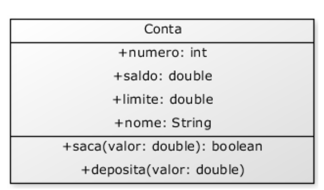
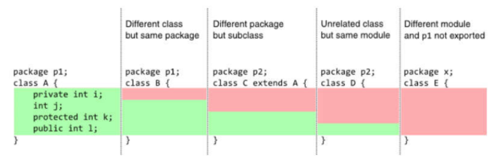

# POO com Java

## Sumário

[Introdução à Programação Orientada a Objetos](#introdução-à-programação-orientada-a-objetos)
- [Paradigma de Programação](#1-paradigma-de-programação)
- [Por que Usar POO?](#3-por-que-usar-poo)
- [Abstração](#4-abstração)
- [Instância e Instanciação](#5-instância-e-instanciação)
- [Classe, Objeto, Atributos e Métodos](#classe-objeto-atributos-e-métodos)
1. [Conceitos Iniciais](#1-conceitos-iniciais)  
   1.2 [Projeto de Classes com UML](#12-projeto-de-classes-com-uml)  
2. [Definindo Classes](#2-definindo-classes)  
   2.1 [Atributos](#21-atributos)  
   2.2 [Criando Objetos](#22-criando-objetos)  
   2.3 [Acessando e Modificando Atributos](#23-acessando-e-modificando-atributos)  
3. [Membros Estáticos](#3-membros-estáticos)  
4. [Métodos](#4-métodos)  
   4.1 [Definindo Métodos](#41-definindo-métodos)  
   4.2 [Métodos com Retorno](#42-métodos-com-retorno)  
   4.3 [O Método transfere](#43-o-método-transfere)  
5. [Referências em Java](#5-referências-em-java)  
   5.1 [Como Referências Funcionam](#51-como-referências-funcionam)  
   5.2 [Comparando Objetos com ==](#52-comparando-objetos-com--)  
6. [Exemplo Completo](#6-exemplo-completo)  
7. [Atributos](#7-atributos)  
   7.1 [Atributos como Referências para Outras Classes](#71-atributos-como-referências-para-outras-classes)  
   7.2 [O Problema de null](#72-o-problema-de-null)  
   7.3 [Referências e null](#73-referências-e-null)  
---
[Controle de Acesso e Encapsulamento](#controle-de-acesso-e-encapsulamento)

8. [Palavra-chave this](#8-palavra-chave-this)  
   8.1 [Diferenciando Atributos de Variáveis Locais](#81-diferenciando-atributos-de-variáveis-locais)  
   8.2 [Passando o Próprio Objeto como Argumento](#82-passando-o-próprio-objeto-como-argumento)  
9. [Controlando o Acesso](#9-controlando-o-acesso)  
   9.1 [Problemas com Acesso Direto a Atributos](#91-problemas-com-acesso-direto-a-atributos)  
   9.2 [Encapsulamento para Proteger os Dados](#92-encapsulamento-para-proteger-os-dados)  
10. [Encapsulamento e Modificadores de Acesso](#10-encapsulamento-e-modificadores-de-acesso)  
    10.1 [Benefícios do Encapsulamento](#101-benefícios-do-encapsulamento)  
    10.2 [Interface vs. Implementação](#102-interface-vs-implementação)  
    10.3 [Modificadores de Acesso Detalhados](#103-modificadores-de-acesso-detalhados)  
11. [Exemplo Prático: Validação de CPF](#11-exemplo-prático-validação-de-cpf)  
12. [Getters e Setters](#12-getters-e-setters)  
    12.1 [Problema do Acesso Direto](#121-problema-do-acesso-direto)  
    12.2 [O Papel dos Getters e Setters](#122-o-papel-dos-getters-e-setters)  
    12.3 [Aprofundando](#123-aprofundando)  
13. [Construtores](#13-construtores)  
    13.1 [O Que é um Construtor?](#131-o-que-é-um-construtor)  
    13.2 [Construtor Default](#132-construtor-default)  
    13.3 [Construtores com Argumentos](#133-construtores-com-argumentos)  
    13.4 [Sobrecarga de Construtores](#134-sobrecarga-de-construtores)  
    13.5 [Chamando Outro Construtor com this()](#135-chamando-outro-construtor-com-this)  
14. [Introdução aos Atributos de Classe](#14-introdução-aos-atributos-de-classe)  
    14.1 [Definição de Atributos Estáticos](#141-definição-de-atributos-estáticos)  
15. [Métodos Estáticos](#15-métodos-estáticos)  
    15.1 [Características dos Métodos Estáticos](#151-características-dos-métodos-estáticos)  
    15.2 [Comparação: Métodos Estáticos vs. Métodos de Instância](#152-comparação-métodos-estáticos-vs-métodos-de-instância)

    15.3 [Diferenças entre Atributo Estático e Método Estático](#153-diferenças-entre-atributo-estático-e-método-estático)

    [Exemplo Prático: Controle de Contas Bancárias](#exemplo-prático-controle-de-contas-bancárias)  
---
[Herança e Polimorfismo](#herança-e-polimorfismo)

16. [Herança, Reescrita de Métodos, Polimorfismo e Composição](#16-herança-reescrita-de-métodos-polimorfismo-e-composição)  
    16.1 [Herança](#161-herança)  
    16.2 [Reescrita de Método (Override)](#162-reescrita-de-método-override)  
    16.3 [Polimorfismo](#163-polimorfismo)  
    16.4 [Exemplo Prático com Faculdade](#164-exemplo-prático-com-faculdade)  

---
## Introdução à Programação Orientada a Objetos

A Programação Orientada a Objetos (POO) organiza o desenvolvimento de software em torno de **objetos**, representando entidades do mundo real ou conceitos abstratos. Esse paradigma torna o código mais intuitivo e modular, pois cada objeto encapsula dados e comportamentos de maneira clara.

---

### 1. Paradigma de Programação

Um **paradigma de programação** descreve como resolver problemas e estruturar programas. Existem vários paradigmas, como:

- **Procedural:** Enfatiza uma sequência de instruções, onde o programa é dividido em funções (exemplo: C).  
- **Orientado a Objetos:** Foca em objetos que combinam dados e comportamentos (exemplos: Java, C++, Python).  
- **Funcional:** Trata o código como funções matemáticas puras, evitando mudanças de estado (exemplo: Haskell).  
- **Lógico:** Baseia-se em declarações lógicas e regras para derivar conclusões (exemplo: Prolog).  
- **Declarativo:** Especifica o que o programa deve fazer, sem detalhar como (exemplos: SQL, HTML).

---

### 3. Por que Usar POO?

- **Legibilidade**: O código é organizado em “blocos” que correspondem a entidades do problema (por exemplo, “Carro”, “Cliente” etc.).  
- **Reusabilidade**: As classes podem ser aproveitadas em diversas partes do sistema ou em outros projetos.  
- **Manutenção Facilitada**: Alterações são centralizadas em cada classe, facilitando testes e correções.  

*Exemplo de abordagem:*  
Em um sistema que calcula a área de triângulos, a abordagem procedural exigiria várias variáveis e funções separadas para cada triângulo. Com POO, podemos ter uma classe “Triângulo” que agrupe os dados (lados) e comportamentos (cálculo da área) em um só lugar, tornando o código mais organizado.

---

### 4. Abstração

A **abstração** consiste em representar um objeto real apenas com as informações necessárias ao contexto do sistema, ignorando detalhes supérfluos. Por exemplo:


- **Abstração Visual de um Carro**: Pode-se representar cor, modelo e forma, omitindo detalhes de engenharia.  
- **Abstração Funcional de um Carro**: Foca em características mecânicas, como sistema de freios, motor e embreagem, se o objetivo for simular o desempenho.

Ao definir quais informações são mais relevantes, os atributos e métodos de uma classe variam conforme o nível de detalhe escolhido. Isso ajuda a reduzir a complexidade e a facilitar a manutenção.

---

### 5. Instância e Instanciação

- **Instância**: É o objeto propriamente dito. Se a classe “Carro” é o “molde”, então um *Carro vermelho 2024* é uma instância específica daquele molde.  
- **Instanciação**: É o processo de criar a instância na memória. Em Java, quando usamos um operador para criar o objeto, esse espaço é alocado na memória e uma referência é retornada para ser usada no programa.


Visualize como se estivéssemos construindo uma carro: o molde (classe) descreve como o carro deve ser, mas o carro de verdade (instância) só existe após a construção (instanciação).

---

## Classe, Objeto, Atributos e Métodos

A **POO** baseia-se em quatro conceitos essenciais:

1. **Classe**  
   É o “molde” de um objeto. Descreve quais dados (atributos) e comportamentos (métodos) o objeto deve ter.

2. **Objeto**  
   É a realização concreta de uma classe, criado em tempo de execução. Cada objeto tem seu próprio estado e pode executar comportamentos definidos na classe.


3. **Atributos**  
   São as características que armazenam o estado de um objeto. No exemplo de um carro, os atributos poderiam ser “cor”, “modelo”, “velocidade”.


4. **Métodos**  
   São funções que definem os comportamentos de um objeto. Por exemplo, um carro pode ter métodos como “acelerar”, “frear” ou “ligarMotor”, que manipulam ou consultam os atributos.

---

### Exemplo Conceitual 

- **Classe**: “Carro”
  - **Atributos**: cor, modelo, velocidadeAtual
  - **Métodos**: acelerar(), frear(), ligarMotor()

- **Objeto**: Carro específico (por exemplo, um carro vermelho, modelo “XYZ”, velocidade atual de X km/h)
  - Quando chamamos `acelerar()`, o objeto altera o valor do atributo “velocidadeAtual”
  - Se chamamos `frear()`, a velocidade diminui.

Nesse esquema, a classe descreve o que o carro pode ter e fazer; o objeto é um carro individual em uso. Os atributos guardam os dados (velocidade, cor), e os métodos definem os comportamentos (acelerar, frear).

---

<br>

## 1. Conceitos Iniciais

### 1.2 Projeto de Classes com UML

UML (*Unified Modeling Language*) é uma linguagem visual para modelar sistemas de software. Ela permite representar classes, atributos, métodos, relacionamentos e interações, facilitando o design e a compreensão do sistema antes da implementação.

*Exemplo – Diagrama UML da classe Conta:*  
- **Atributos:** `numero`, `dono`, `saldo`, `limite`  
- **Visibilidade:**  
  - `-` indica privado (acesso restrito).  
  - `+` indica público (acesso externo).


---

<br>

## 2. Definindo Classes

Até agora vimos exemplos com Carros, mas apartir de agora em iremos considerar o cenario de um Banco, qual é a entidade mais importante para um banco? A conta.

Quais são os atributos impotantes em uma Conta?
– Número da conta
– Nome do cliente
– Saldo
– Limite

O que toda conta faz? Isto é, quais são seus metodos.
– saca 
– deposita 
– transfere 

Veja como ficaria uma conta em Java:

```java
class Conta {
    ...
}
```

O que temos até agora é o molde da conta (Classe) ainda precisamos
construir (instanciar) essa conta, para poder acessar o que ela tem, e pedir para ela fazer alguma coisa.


### 2.1 Atributos

Atributos são as variáveis que definem as características e o estado de um objeto. Note que declaramos os atributos diretamente dentro do escopo da classe, desta forma eles são variáveis do objeto Conta.

```java
class Conta {
    int numero;
    String dono;
    double saldo;
    double limite;
}
```

### 2.2 Criando Objetos

Até agora temos a classe conta e seus atributos, mais ainda não temos a conta propriamente dita, para criar (instanciar) um objeto, utilizamos o operador `new`.

```java
Conta minhaConta = new Conta();
```

### 2.3 Acessando e Modificando Atributos

Após criar o objeto, precisamos criar metodos para alterar os atributos da Conta, para isso criamos o metodo que realiza a operação que desejamos (Ex: saldo, retorna o saldo atual da conta) e chamamos ele utilizando o operador '.', conforme exemplificado a baixo:

```java
minhaConta.dono = "João";
minhaConta.saldo = 1000.0;
System.out.println(minhaConta.saldo);
```
NO exemplo a cima alteramos o nome do dono da conta para João e alteramos o saldo dessa conta.

---

<br>

## 3. Membros Estáticos

Membros estáticos pertencem à classe e não a instâncias individuais. São úteis para constantes e métodos utilitários.


- **Estáticos:** São compartilhados entre todas as instâncias e não acessam `this`.
- **Não Estáticos:** Pertencem a cada objeto individualmente.

---

## 4. Métodos

### 4.1 Definindo Métodos

Métodos representam comportamentos de um objeto. Veja o metodo 'saca' a baixo que recebe como parametro uma quantidade e subtrai esse valor do saldo:

```java
void saca(double quantidade) {
    this.saldo -= quantidade;
}
```

### 4.2 Métodos com Retorno

Métodos podem retornar valores para indicar resultados ou estados.

```java
boolean saca(double valor) {
    if (this.saldo < valor) {
        return false;
    }
    this.saldo -= valor;
    return true;
}
```

### 4.3 O Método transfere

Quando criamos um metodo para transferir valores entre contas podemos fica tentados a criar um método que recebe dois parâmetros: conta1 e conta2 do tipo Conta. Mas cuidado: assim estamos pensando de maneira procedural.

A idéia é que quando chamarmos o método transfere, já teremos um objeto do tipo Conta instanciado,portanto o método recebe apenas dois parâmetros, a Conta destino e o valor.

```java
boolean transfere(Conta destino, double valor) {
    if (this.saca(valor)) {
        destino.deposita(valor);
        return true;
    }
    return false;
}
```


---

## 5. Referências em Java

Quando declaramos uma variável para associar a um objeto, na verdade, essa variável não guarda o objeto, e sim uma maneira de acessá-lo, chamada de referência.

### 5.1 Como Referências Funcionam

Em Java, variáveis de objeto armazenam referências (endereços) para objetos na memória.

```java
Conta c1 = new Conta();
Conta c2 = c1;
```

*Exemplo gráfico:*


### 5.2 Comparando Objetos com ==

O operador `==` verifica se duas variáveis referenciam o mesmo objeto na memória.

```java
Conta c1 = new Conta();
Conta c2 = new Conta();
System.out.println(c1 == c2); // false, pois são objetos distintos.
```

---

<br>

## 6. Exemplo Completo

No nosso exemplo de COnta bancária, temos a seguinte estrutura de pastas:

```
Banco/
│── src/
│   ├── main/
│   │   ├── java/
│   │   │   └── banco/
│   │   │       ├── modelo/
│   │   │       │   └── Conta.java
│   │   │       ├── aplicacao/
│   │   │       │   └── ContaAplicacao.java
```

Nosso codigo fica assim:

`Conta.java`:

```java
package banco.modelo;

public class Conta {
    int numero;
    String dono;
    double saldo;
    double limite;

    public void saca(double quantidade) {
        if (quantidade <= saldo) {
            this.saldo -= quantidade;
        }
    }

    public void deposita(double quantidade) {
        this.saldo += quantidade;
    }

    public boolean transfere(Conta destino, double valor) {
        if (valor <= saldo) {
            this.saca(valor);
            destino.deposita(valor);
            return true;
        }
        return false;
    }
}
```

`ContaAplicacao.java`:

```java
javapackage banco.aplicacao;

import banco.modelo.Conta;

public class ContaAplicacao {
    public static void main(String[] args) {
        Conta minhaConta = new Conta();
        minhaConta.dono = "João";
        minhaConta.saldo = 1000;

        minhaConta.saca(200);
        minhaConta.deposita(500);

        Conta outraConta = new Conta();
        outraConta.dono = "John";
        minhaConta.transfere(outraConta, 300);

        System.out.println("Saldo de " + minhaConta.dono + ": " + minhaConta.saldo);
        System.out.println("Saldo de " + outraConta.dono + ": " + outraConta.saldo);
    }
```

---

<br>

## 7. Atributos

Em Java, as variáveis de instância (atributos de uma classe) diferem das variáveis locais (declaradas dentro de um método). Enquanto as variáveis locais precisam ser explicitamente inicializadas antes do uso, os atributos de uma classe recebem valores padrão automaticamente:

- **Tipos numéricos**: Inicializados com `0`
- **Tipo `boolean`**: Inicializado com `false`
- **Tipos referência (objetos)**: Inicializados com `null`

Além disso, é possível definir valores padrão para os atributos diretamente na sua declaração. Veja o exemplo de uma classe `Conta` com valores iniciais definidos:

```java
class Conta {
    int numero = 1234;
    String dono = "João";
    String cpf = "123.456.789-10";
    double saldo = 1000;
    double limite = 1000;
}
```

Quando um objeto `Conta` for criado, ele já terá seus atributos preenchidos com esses valores.

### 7.1 Atributos como Referências para Outras Classes

Os atributos de uma classe podem ser referências para objetos de outras classes. Suponha a classe `Cliente`:

```java
class Cliente {
    String nome;
    String sobrenome;
    String cpf;
}
```

Agora, podemos adicionar um atributo do tipo `Cliente` na classe `Conta`:

```java
class Conta {
    int numero;
    double saldo;
    double limite;
    Cliente cliente; // Referência para um objeto Cliente
}
```

Esse atributo `cliente` será inicializado como `null`, pois é uma variável de referência e ainda não aponta para nenhum objeto.


### 7.2 O Problema de null

Se tentarmos acessar `minhaConta.cliente` sem antes instanciá-lo, teremos um erro de execução:

```java
class Teste {
    public static void main(String[] args) {
        Conta minhaConta = new Conta(); // Criamos a conta, mas não o cliente!

        minhaConta.cliente.nome = "Paulo"; // ERRO: NullPointerException!
    }
}
```

Isso acontece porque `minhaConta.cliente` ainda é `null`. Para evitar esse problema, podemos inicializar o cliente no momento da criação da conta:

```java
class Conta {
    int numero;
    double saldo;
    double limite;
    Cliente cliente = new Cliente(); // Cliente criado automaticamente
}
```

Agora, sempre que criarmos uma nova `Conta`, um objeto `Cliente` será instanciado junto.

---

### Qual Abordagem Escolher?

A decisão de inicializar automaticamente um `Cliente` dentro da `Conta` depende do contexto:

- **Se toda conta sempre deve ter um cliente**, a inicialização automática (`new Cliente()`) pode ser uma boa escolha.
- **Se nem toda conta precisa de um cliente imediatamente**, pode ser melhor deixar `cliente` como `null` e criar o objeto apenas quando necessário.

Cada caso exige uma análise do problema para decidir a melhor abordagem.

---

<br>
<br>
<br>
<br>

---

## 8. Palavra-chave this

### 8.1 Diferenciando Atributos de Variáveis Locais

A palavra-chave `this` referencia o objeto atual, diferenciando atributos de variáveis locais.

```java
public class Produto {
    private String nome;
    private double preco;

    public Produto(String nome, double preco) {
        this.nome = nome; 
    // this.nome refere-se ao atributo 'nome' da classe Produto
        this.preco = preco;
    }
}
```

### 8.2 Passando o Próprio Objeto como Argumento

`this` pode ser passado para métodos ou construtores de outras classes para referenciar o objeto atual.

```java
public class ChessMatch {
    public void startMatch() {
        placeNewPiece('e', 1, new King(this));
    }
}
```

---

<br>
<br>

## 9. Controlando o Acesso

### 9.1 Problemas com Acesso Direto a Atributos

Um dos problemas que temos no nosso sistema de contas é que a **função saca** permite sacar mesmo que o limite tenha sido atingido. Para podermos resolver esse problema, podemos criar o **método saca**:

```java
class Conta {
    String titular;
    int numero;
    double saldo;

    void saca(double valor) {
        this.saldo -= valor;
    }
}
```

Caso desejemos, ainda podemos incluir um **'if'** dentro do nosso método saca() para evitar que o cliente sacasse um valor maior que o saldo.

### 9.2 Encapsulamento para Proteger os Dados

Ainda temos um problema em nosso codigo, ninguém garante que o Cliente vai sempre utilizar o método correto para alterar o saldo da conta. A melhor forma de resolver isso é forçar quem usa a classe Conta a chamar o método saca e não permitir o acesso direto ao atributo.

Desta forma, encapsulamos atributos (usando `private`) e acessamos/modificamos eles através de métodos (getters/setters) garantindo a integridade dos dados. Como no exemplo a baixo:

```java
class Conta {
    private double saldo;

    public void saca(double valor) {
        if (valor > saldo) {
            System.out.println("Saldo insuficiente!");
        } else {
            saldo -= valor;
        }
    }

    public void deposita(double valor) {
        saldo += valor;
    }

    public double getSaldo() {
        return saldo;
    }
}
```

É muito comum, que em uma classe, seus atributos sejam private, e quase todos seus métodos sejam public (**não** é uma regra!).

O conjunto de métodos públicos de uma classe é também chamado de **interface da classe**, pois esta é a maneira a qual você se comunica com essa classe.

---

<br>


## 10. Encapsulamento e Modificadores de Acesso

### 10.1 Benefícios do Encapsulamento

- **Controle de Acesso:** Restringe a modificação de atributos somente por métodos autorizados.
- **Facilidade de Manutenção:** Centraliza regras de negócio.
- **Segurança:** Evita estados inválidos nos objetos.
- **Baixo Acoplamento:** Reduz dependências entre classes.

### 10.2 Interface vs. Implementação

- **Interface:** Conjunto de métodos públicos que definem como interagir com a classe.  
- **Implementação:** Código interno que realiza as operações, podendo ser alterado sem afetar a interface.

### 10.3 Modificadores de Acesso

Os modificadores de acesso em Java controlam a visibilidade de atributos, métodos e construtores:

- **private:**  
  - **Visibilidade:** Apenas dentro da própria classe.  
  - **Uso:** Proteger detalhes internos.  
  - *Exemplo:*  
    ```java
    private double saldo;
    ```
- **default (sem modificador):**  
  - **Visibilidade:** Apenas no mesmo pacote.  
  - **Uso:** Permitir colaboração entre classes do mesmo pacote.  
- **protected:**  
  - **Visibilidade:** No mesmo pacote e em subclasses (mesmo em pacotes diferentes).  
  - **Uso:** Permitir acesso controlado em hierarquias de herança.  
- **public:**  
  - **Visibilidade:** Acessível de qualquer classe, em qualquer pacote.  
  - **Uso:** Expor métodos ou atributos essenciais.

*A tabela abaixo ilustra a visibilidade:*

| Modificador | Mesma Classe | Mesmo Pacote | Subclasse (outro pacote) | Outros Pacotes |
|-------------|--------------|--------------|--------------------------|----------------|
| private     | ✅           | ❌           | ❌                       | ❌             |
| default     | ✅           | ✅           | ❌                       | ❌             |
| protected   | ✅           | ✅           | ✅                       | ❌             |
| public      | ✅           | ✅           | ✅                       | ✅             |

<br></br>



---

## 11. Exemplo Prático: Validação de CPF

A classe `Cliente` valida o CPF antes de atribuí-lo, protegendo o objeto de dados inválidos.

```java
class Cliente {
    private String nome;
    private String endereco;
    private String cpf;

    public void mudaCPF(String cpf) {
        validaCPF(cpf);
        this.cpf = cpf;
    }

    private void validaCPF(String cpf) {
        if (cpf == null || cpf.length() != 11) {
            throw new IllegalArgumentException("CPF inválido!");
        }
    }
}
```

*Teste:*

```java
class TestaCliente {
    public static void main(String[] args) {
        Cliente cliente = new Cliente();
        cliente.mudaCPF("12345678901");
    }
}
```
---

<br>

## 12. Getters e Setters

Com o encapsulamento nos 'escondemos' os membros de uma classe, mas e quando precisamos visualizar ou alterar eles, como fazemos?

### 12.1 Problema do Acesso Direto

Para permitir o acesso aos atributos de uma maneira controlada, a prática mais comum é de criar dois métodos, um que retorna o valor e outro que muda o valor.

### 12.2 O Papel dos Getters e Setters

Esses métodos controlam o acesso e a modificação dos atributos privados, permitindo validações e formatações.

O padrão para esses métodos é de colocar a palavra **get** ou **set** antes do nome do atributo. Por exemplo, para consultar quem é o titular de uma conta ou alterar ele, seguimos o seguinte modelo

```java
class Conta {
    private String titular;
    private double saldo;

    public String getTitular() {
        return this.titular;
    }

    public void setTitular(String titular) {
        this.titular = titular;
    }
}
```

### 12.3 Aprofundando

**Resumo com essência e didática mantidas:**

Criar *getters* e *setters* automaticamente para todos os atributos de uma classe é uma má prática. Só devem ser criados quando houver real necessidade. 

Por exemplo, se existem métodos como `saca()` ou `retira()` para manipular o saldo, não faz sentido expor um `setSaldo()`, pois isso quebraria o controle sobre como o saldo é alterado.

Além disso, um método chamado `getX()` não precisa necessariamente retornar diretamente o atributo `x`. Isso faz parte do encapsulamento: podemos, por exemplo, definir que `getSaldo()` retorne o saldo somado ao limite, como os bancos costumam mostrar para os clientes. Assim, caso a lógica mude futuramente, basta alterar o `getSaldo()` — sem necessidade de alterar todos os pontos do código que usam essa informação.

```java
public class Conta {

    private double saldo;
    private double limite;
    private Cliente dono;

    private double getSaldo() {
        return this.saldo + this.limite;
    }

    // deposita() e saca()

    public Cliente getDono() {
        return this.dono;
    }

    public void setDono(Cliente dono) {
        this.dono = dono;
    }
}
```

No exemplo dado, não existe um `getLimite()`, pois ainda não há necessidade disso. E `getSaldo()` já entrega exatamente o que queremos que o usuário veja, e não apenas o valor interno do atributo `saldo`.

Esse uso de *getters* e *setters* controlados, além de proteger os dados, permite mudanças localizadas no código — característica essencial do encapsulamento.

Por fim, mesmo com todos esses cuidados, é preciso validar os dados de entrada. Se o método `deposita()` aceitar valores negativos, o saldo pode acabar ficando abaixo do permitido. Isso pode ser evitado com uma simples verificação dentro do próprio método. Graças ao encapsulamento, essa mudança afeta apenas o método — sem impacto no restante do sistema.


---

<br>

## 13. Construtores

### 13.1 O Que é um Construtor?

Construtores são blocos especiais, declarados com o mesmo nome que a classe, que inicializam os objetos no momento da criação.

```java
class Conta {
    int numero;
    String dono;
    double saldo;
    double limite;

    //construtor
    Conta() {
        System.out.println("Nova conta criada!");
    }
}
```

Então, quando fizermos:

```java
Conta c = new Conta();
```

A mensagem "Nova conta criada!" aparecerá.

### 13.2 Construtor Default

Se nenhum construtor for declarado, o Java fornece um construtor sem parâmetros que inicializa os atributos com valores padrão.
A partir do momento que você declara um construtor, o construtor default não é mais fornecido.

### 13.3 Construtores com Argumentos

Construtores permitem inicializar atributos com valores específicos no momento da criação.

```java
class Conta {
    private String titular;

    Conta(String titular) {
        this.titular = titular;
    }
}
```

Esse construtor recebe o titular da conta. Assim, quando criarmos uma conta ela já terá um determinado dono.

```java
Conta c = new Conta("João");
System.out.println(c.titular);
```

O construtor se **resume** a dar possibilidades ou obrigar o usuário de uma classe à passar argumentos para o objeto durante o processo de criação do mesmo.

Um construtor **não** é um método, já que não possui retorno e só é chamado durante a construção do objeto.

### 13.4 Sobrecarga de Construtores

Uma classe pode ter vários construtores com assinaturas diferentes para maior flexibilidade.

```java
class Conta {
    private String titular;
    private double saldo;

    Conta() {}

    Conta(String titular) {
        this.titular = titular;
    }

    Conta(String titular, double saldo) {
        this(titular);
        this.saldo = saldo;
    }
}
```

### 13.5 Chamando Outro Construtor com this()

Um construtor só pode rodar durante a construção do objeto, ou seja, nunca será possivél chamar o construtor em um objeto já construído. 

Porém, durante a construção de um objeto, você pode fazer com que um construtor chame outro.

Para isso, utilizamos a palavra **`this()`** para chamar outro construtor, evitando duplicação de código.

```java
class Conta {
    private String titular;
    private int numero;

    Conta(String titular) {
        this.titular = titular;
    }

    Conta(String titular, int numero) {
        this(titular); // chama o construtor que foi declarado acima
        this.numero = numero;
    }
}
```

---

<br>

## 14. Introdução aos Atributos de Classe

Nosso banco quer controlar quantas contas foram criadas no sistema. Qual seria a forma mais simples de fazer isso?

```java
Conta c = new Conta();
totalDeContas = totalDeContas + 1;
```

O problema é que esse controle ficaria espalhado por todo o sistema. E se esquecermos de atualizar essa variável em algum lugar? Isso já nos lembra o problema da validação de CPF.

Vamos tentar fazer isso dentro da própria classe:

```java
class Conta {
    private int totalDeContas;

    Conta() {
        this.totalDeContas = this.totalDeContas + 1;
    }
}
```

Se criarmos duas contas com esse código, o que acontece? Cada conta terá sua própria cópia da variável `totalDeContas`, então o valor será sempre 1. Ou seja, o atributo **é de cada objeto**, não da classe.

### 14.1 Definição de Atributos Estáticos

O ideal seria que essa variável fosse **compartilhada entre todos os objetos**, para que ao alterar em um lugar, todos vejam o novo valor. Para isso, usamos o modificador **`static`**:

```java
private static int totalDeContas;
```

Com `static`, o atributo deixa de pertencer a cada objeto e passa a pertencer **à classe**. O valor é único e compartilhado.

Para atualizar essa variável, usamos o nome da classe em vez de `this`:

```java
class Conta {
    private static int totalDeContas;

    Conta() {
        Conta.totalDeContas = Conta.totalDeContas + 1;
    }
}
```

Como `totalDeContas` é `private`, precisamos de um **getter** para acessá-la de fora da classe:

```java
class Conta {
    private static int totalDeContas;

    Conta() {
        Conta.totalDeContas = Conta.totalDeContas + 1;
    }

    public int getTotalDeContas() {
        return Conta.totalDeContas;
    }
}
```

Agora podemos descobrir quantas contas existem assim:

```java
Conta c = new Conta();
int total = c.getTotalDeContas();
```

Mas tem um detalhe: só conseguimos acessar o método se tivermos uma conta criada. O ideal seria consultar essa informação **sem precisar de um objeto**. Para isso, também deixamos o método como `static`:

```java
public static int getTotalDeContas() {
    return Conta.totalDeContas;
}
```

Agora podemos acessar diretamente:

```java
int total = Conta.getTotalDeContas();
```

Note que estamos chamando o método usando o **nome da classe**, não um objeto.

---

<br>

## 15. Métodos Estáticos

### 15.1 O que são Métodos Estáticos

Um **método estático** é aquele que pertence à **classe**, e não a um objeto específico. Isso significa que:

- Ele **não depende do estado (atributos)** de nenhuma instância (objeto).
- Ele **não pode usar o `this`**, pois `this` se refere a um objeto, e métodos estáticos são independentes de objetos.
- Pode ser chamado diretamente usando o **nome da classe**, sem precisar criar um objeto.

#### Exemplo:

```java
class Calculadora {
    public static double soma(double a, double b) {
        return a + b;
    }
}
```

Para usar esse método:

```java
double resultado = Calculadora.soma(10, 5);
```

Não precisamos instanciar um objeto da classe `Calculadora` para usar o método `soma`.

---

### 15.2 Diferença entre Métodos Estáticos e Métodos de Instância

#### **Métodos Estáticos:**
- São usados quando **a lógica do método não depende de atributos do objeto**.
- Normalmente aplicados em **operações utilitárias ou matemáticas**, como em classes auxiliares (`Math`, `Arrays`, `Collections`, etc.).
- Exemplo clássico: `Math.pow(2, 3)` – calcula 2 elevado a 3.

#### **Métodos de Instância:**
- Operam sobre **dados específicos de um objeto**.
- Precisam de um objeto para serem chamados, pois usam atributos de instância.

#### Comparação rápida:

| Tipo                  | Usa atributos do objeto? | Precisa de objeto para chamar? | Exemplo de uso             |
|-----------------------|--------------------------|-------------------------------|----------------------------|
| Método Estático       | Não                      | Não                            | `Calculadora.soma(2, 3)`   |
| Método de Instância   | Sim                      | Sim                            | `conta.getSaldo()`         |

Boa pergunta, Diego! Não, **atributo estático** e **método estático** **não são a mesma coisa**, embora compartilhem o uso da palavra-chave `static` e pertençam à classe, não ao objeto. Vamos esclarecer:

---

### **Atributo Estático (`static`)**

- É uma **variável que pertence à classe**.
- **Todos os objetos compartilham o mesmo valor** desse atributo.
- Usado quando a informação é **comum a todas as instâncias** (por exemplo, contar quantos objetos foram criados).

#### Exemplo:
```java
class Conta {
    private static int totalDeContas = 0;

    public Conta() {
        Conta.totalDeContas++;
    }

    public static int getTotalDeContas() {
        return totalDeContas;
    }
}
```

> `totalDeContas` é um **atributo estático**: independente da instância, ele guarda a contagem total de objetos criados.

---

### 15.3 Diferenças entre Atributo Estático e Método Estático

### **Método Estático (`static`)**

- É um **método que pertence à classe**, não a uma instância.
- **Não pode acessar atributos ou métodos de instância diretamente**.
- Pode ser chamado **sem criar um objeto**.

#### Exemplo:
```java
class Util {
    public static int dobro(int valor) {
        return valor * 2;
    }
}
```

> `dobro` é um **método estático**: realiza uma operação genérica, sem depender de atributos de instância.

---

### Resumo da Diferença

| Característica            | Atributo Estático         | Método Estático            |
|---------------------------|---------------------------|-----------------------------|
| Pertence à classe         | Sim                        | Sim                         |
| Compartilhado entre objetos | Sim                      | Não se aplica               |
| Depende de objeto         | Não                        | Não                         |
| Acesso direto via classe  | Sim (`Classe.atributo`)   | Sim (`Classe.metodo()`)     |
| Usa `this`                | Não                        | Não                         |


<br>

---

## Exemplo Controle de Contas Bancárias

Exemplo de uma classe `Conta` que utiliza atributos e métodos estáticos para controlar o número total de contas.

```java
class Conta {
    private static int totalDeContas = 0;
    private String titular;
    private double saldo;

    Conta(String titular) {
        this.titular = titular;
        this.saldo = 0.0;
        Conta.totalDeContas += 1;
    }

    public static int getTotalDeContas() {
        return Conta.totalDeContas;
    }

    public void deposita(double valor) {
        if (valor > 0) {
            this.saldo += valor;
        }
    }

    public double getSaldo() {
        return this.saldo;
    }
}
```

Programa principal:

```java
public class ProgramaPrincipal {
    public static void main(String[] args) {
        Conta conta1 = new Conta("João");
        conta1.deposita(1000);

        Conta conta2 = new Conta("Maria");
        conta2.deposita(500);

        System.out.println("Saldo da conta 1: " + conta1.getSaldo());
        System.out.println("Saldo da conta 2: " + conta2.getSaldo());
        System.out.println("Total de contas: " + Conta.getTotalDeContas());
    }
}
```

---

<br>
<br>

---

# 16. Herança, Reescrita de Métodos, Polimorfismo e Composição

### 16.1 Herança

Em um sistema bancário, podemos começar modelando um **funcionário genérico** com atributos como nome, CPF e salário. No entanto, há cargos específicos, como o de **gerente**, que possuem **características adicionais**, como uma senha para acessar o sistema interno do banco. 

Uma abordagem equivocada seria simplesmente adicionar o atributo `senha` à classe `Funcionario`, deixando-o vazio quando o funcionário não for um gerente. Porém, isso compromete o design, pois introduz comportamento irrelevante para alguns objetos.

Em vez disso, usamos o conceito de **herança**, onde criamos uma classe `Gerente` que **herda** os atributos e métodos da classe `Funcionario`. Em Java, fazemos isso com a palavra-chave `extends`. Dessa forma, `Gerente` se torna uma **subclasse** de `Funcionario`, que é a **superclasse**. 

O gerente herda todos os comportamentos do funcionário, mas pode também definir novos comportamentos, como o método `autentica(int senha)`.

```java
class Funcionario {
    String nome;
    String cpf;
    double salario;
}

class Gerente extends Funcionario {
    int senha;

    public boolean autentica(int senha) {
        if (this.senha == senha) {
            System.out.println("Acesso Permitido!");
            return true;
        } else {
            System.out.println("Acesso Negado!");
            return false;
        }
    }
}
```

Ao instanciar um gerente, ele terá acesso tanto aos atributos herdados quanto aos novos:

```java
Gerente gerente = new Gerente();
gerente.nome = "João da Silva";
gerente.senha = 4231;
```

Apesar da herança incluir atributos e métodos `private`, a subclasse **não pode acessá-los diretamente**. Para isso, usamos o modificador `protected`, que permite o acesso **dentro da própria classe e das subclasses**.

```java
class Funcionario {
    protected String nome;
    protected String cpf;
    protected double salario;
}
```

Embora `protected` seja útil, ele **aumenta o acoplamento** entre as classes. Em muitos casos, manter os atributos como `private` e acessá-los por **getters e setters** continua sendo a opção mais segura.

---

### 16.2 Reescrita de Método (Override)

Ao final do ano, todos os funcionários do banco recebem uma **bonificação**. Funcionários comuns recebem 10% do salário, enquanto gerentes recebem 15%. Se deixarmos o método `getBonificacao` apenas na superclasse, todos herdarão o mesmo cálculo.

```java
class Funcionario {
    protected String nome;
    protected String cpf;
    protected double salario;

    public double getBonificacao() {
        return this.salario * 0.10;
    }
}
```

Porém, como o gerente possui uma bonificação diferente, precisamos **reescrever** esse método dentro da subclasse `Gerente`, usando a técnica de **override**:

```java
class Gerente extends Funcionario {
    int senha;

    @Override
    public double getBonificacao() {
        return this.salario * 0.15;
    }
}
```

Se testarmos esse comportamento:

```java
Gerente gerente = new Gerente();
gerente.salario = 5000.0;
System.out.println(gerente.getBonificacao()); // 750.0
```

O método chamado será o da **classe real do objeto** (Gerente), mesmo que a referência seja do tipo `Funcionario`.

<br>

---

### 16.3 Polimorfismo

**Polimorfismo** é um conceito da programação orientada a objetos que significa:  
> **Um mesmo nome pode se comportar de formas diferentes, dependendo do tipo real do objeto.**

Em Java, isso acontece quando **usamos uma variável de um tipo mais genérico (como uma superclasse) para se referir a um objeto de uma subclasse**.

#### Exemplo prático:

Imagine que temos uma classe `Funcionario` e uma subclasse `Gerente`:

```java
class Funcionario {
    protected double salario;

    public double getBonificacao() {
        return this.salario * 0.10;
    }
}

class Gerente extends Funcionario {
    @Override
    public double getBonificacao() {
        return this.salario * 0.15;
    }
}
```

Agora veja esse código:

```java
Funcionario funcionario = new Gerente();
funcionario.salario = 5000.0;
System.out.println(funcionario.getBonificacao());
```

A pergunta é: qual método será chamado? O de `Funcionario` (10%) ou o de `Gerente` (15%)?

### Resposta: será chamado o método da **classe real** do objeto, ou seja, **`Gerente`**, mesmo que a variável seja do tipo `Funcionario`.

---

### 📦 Representação na memória

Vamos visualizar isso como se fosse uma **caixa com etiqueta** apontando para um **objeto real**:

```
[variável funcionario] ---> (objeto Gerente na memória)
                            +--------------------------+
                            | tipo real: Gerente       |
                            | salario = 5000.0         |
                            | getBonificacao() = 15%   |
                            +--------------------------+
```

Mesmo que a variável `funcionario` diga ser um "Funcionario", na verdade ela aponta para um "Gerente". E o Java, em tempo de execução, vai olhar o **objeto real** e não o **tipo da variável**.

---

### Por que isso é útil?

Porque nos permite escrever **códigos genéricos** que funcionam com diferentes tipos de objetos, sem precisar alterar a lógica toda vez que surgir uma nova subclasse.

Veja o exemplo abaixo:

```java
class ControleDeBonificacoes {
    private double total = 0;

    public void bonifica(Funcionario f) {
        total += f.getBonificacao();
    }

    public double getTotal() {
        return total;
    }
}
```

Podemos usar essa classe com **qualquer tipo de funcionário** (Gerente, Diretor, Secretaria...), sem precisar criar métodos específicos para cada um:

```java
ControleDeBonificacoes controle = new ControleDeBonificacoes();

Funcionario f1 = new Gerente(); // 15%
f1.salario = 5000;
controle.bonifica(f1);

Funcionario f2 = new Funcionario(); // 10%
f2.salario = 1000;
controle.bonifica(f2);

System.out.println(controle.getTotal()); // 750 + 100 = 850
```

---

### 📌 Resumo rápido

- Com **polimorfismo**, você pode usar uma **referência de superclasse** para apontar para **objetos de subclasses**.
- O método chamado é o da **classe real do objeto**, não da variável.
- Isso permite criar **códigos genéricos, reutilizáveis e flexíveis**, promovendo **baixo acoplamento**.

---

### 16.4 Exemplo Prático com Faculdade

Agora vamos adaptar esse conceito para um cenário universitário. Imagine uma classe `EmpregadoDaFaculdade` com nome e salário:

```java
class EmpregadoDaFaculdade {
    private String nome;
    private double salario;

    double getGastos() {
        return this.salario;
    }

    String getInfo() {
        return "nome: " + this.nome + " com salário " + this.salario;
    }
}
```

Um professor, além do salário, recebe um valor adicional por hora/aula. Para isso, criamos a subclasse `ProfessorDaFaculdade`, que **reescreve os métodos** `getGastos` e `getInfo`:

```java
class ProfessorDaFaculdade extends EmpregadoDaFaculdade {
    private int horasDeAula;

    @Override
    double getGastos() {
        return this.getSalario() + this.horasDeAula * 10;
    }

    @Override
    String getInfo() {
        String informacaoBasica = super.getInfo();
        return informacaoBasica + " horas de aula: " + this.horasDeAula;
    }
}
```

Repare que usamos a palavra-chave **`super`** para **acessar métodos da superclasse**, evitando a repetição de código.

Se mais tarde criarmos um `Reitor`:

```java
class Reitor extends ProfessorDaFaculdade {
    @Override
    String getInfo() {
        return super.getInfo() + " e ele é um reitor";
    }
}
```

Nosso sistema continua funcionando **sem precisar alterar o código existente**, como o da classe `GeradorDeRelatorio`:

```java
class GeradorDeRelatorio {
    public void adiciona(EmpregadoDaFaculdade e) {
        System.out.println(e.getInfo());
        System.out.println(e.getGastos());
    }
}
```

Isso mostra o poder do **polimorfismo** aliado à **herança e reescrita de métodos**, permitindo a evolução do sistema sem quebrar o que já existe.

---


