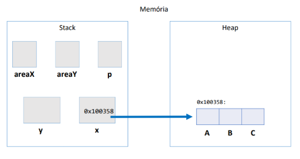

# POO com Java

## Sumário

0. [Introdução à Programação Orientada a Objetos](#0-Introdução-à-Programação-Orientada-a-Objetos)
1. [Conceitos Iniciais](#1-conceitos-iniciais)  
   1.1 [Classes e Objetos](#11-classes-e-objetos)  
   1.2 [Projeto de Classes com UML](#12-projeto-de-classes-com-uml)  
2. [Definindo Classes](#2-definindo-classes)  
   2.1 [Atributos](#21-atributos)  
   2.2 [Criando Objetos](#22-criando-objetos)  
   2.3 [Acessando e Modificando Atributos](#23-acessando-e-modificando-atributos)  
3. [Membros Estáticos](#3-membros-estáticos)  
   3.1 [Atributos e Métodos Estáticos](#31-atributos-e-métodos-estáticos)  
   3.2 [Comparação com Membros Não Estáticos](#32-comparação-com-membros-não-estáticos)  
   3.3 [Melhores Práticas](#33-melhores-práticas)  
4. [Métodos](#4-métodos)  
   4.1 [Definindo Métodos](#41-definindo-métodos)  
   4.2 [Métodos com Retorno](#42-métodos-com-retorno)  
   4.3 [O Método transfere](#43-o-método-transfere)  
5. [Referências em Java](#5-referências-em-java)  
   5.1 [Como Referências Funcionam](#51-como-referências-funcionam)  
   5.2 [Comparando Objetos com ==](#52-comparando-objetos-com--)  
6. [Exemplos de Código](#6-exemplos-de-código)  
   6.1 [Classe Conta](#61-classe-conta)  
   6.2 [Teste de Métodos](#62-teste-de-métodos)  
7. [Atributos](#7-atributos)  
   7.1 [Valores Padrão](#71-valores-padrão)  
   7.2 [Composição de Classes](#72-composição-de-classes)  
   7.3 [Referências e null](#73-referências-e-null)  
8. [Palavra-chave this](#8-palavra-chave-this)  
   8.1 [Diferenciando Atributos de Variáveis Locais](#81-diferenciando-atributos-de-variáveis-locais)  
   8.2 [Passando o Próprio Objeto como Argumento](#82-passando-o-próprio-objeto-como-argumento)  
9. [Controlando o Acesso](#9-controlando-o-acesso)  
   9.1 [Problemas com Acesso Direto a Atributos](#91-problemas-com-acesso-direto-a-atributos)  
   9.2 [Encapsulamento para Proteger os Dados](#92-encapsulamento-para-proteger-os-dados)  
10. [Encapsulamento e Modificadores de Acesso](#10-encapsulamento-e-modificadores-de-acesso)  
    10.1 [Benefícios do Encapsulamento](#101-benefícios-do-encapsulamento)  
    10.2 [Interface vs. Implementação](#102-interface-vs-implementação)  
    10.3 [Modificadores de Acesso Detalhados](#103-modificadores-de-acesso-detalhados)  
11. [Exemplo Prático: Validação de CPF](#11-exemplo-prático-validação-de-cpf)  
12. [Getters e Setters](#12-getters-e-setters)  
    12.1 [Problema do Acesso Direto](#121-problema-do-acesso-direto)  
    12.2 [O Papel dos Getters e Setters](#122-o-papel-dos-getters-e-setters)  
    12.3 [Personalizando Getters](#123-personalizando-getters)  
13. [Construtores](#13-construtores)  
    13.1 [O Que é um Construtor?](#131-o-que-é-um-construtor)  
    13.2 [Construtor Default](#132-construtor-default)  
    13.3 [Construtores com Argumentos](#133-construtores-com-argumentos)  
    13.4 [Sobrecarga de Construtores](#134-sobrecarga-de-construtores)  
    13.5 [Chamando Outro Construtor com this()](#135-chamando-outro-construtor-com-this)  
14. [Resumo e Benefícios](#14-resumo-e-benefícios)  
15. [Introdução aos Atributos de Classe](#15-introdução-aos-atributos-de-classe)  
16. [Atributos Estáticos com static](#16-atributos-estáticos-com-static)  
    16.1 [Definição de Atributos Estáticos](#161-definição-de-atributos-estáticos)  
    16.2 [Acesso e Uso de Atributos Estáticos](#162-acesso-e-uso-de-atributos-estáticos)  
17. [Métodos Estáticos](#17-métodos-estáticos)  
    17.1 [Características dos Métodos Estáticos](#171-características-dos-métodos-estáticos)  
    17.2 [Comparação: Métodos Estáticos vs. Métodos de Instância](#172-comparação-métodos-estáticos-vs-métodos-de-instância)  
18. [Exemplo Prático: Controle de Contas Bancárias](#18-exemplo-prático-controle-de-contas-bancárias)  
19. [Resumo e Benefícios](#19-resumo-e-benefícios)  

---
## Introdução à Programação Orientada a Objetos

A Programação Orientada a Objetos (POO) organiza o desenvolvimento de software em torno de **objetos**, representando entidades do mundo real ou conceitos abstratos. Esse paradigma torna o código mais intuitivo e modular, pois cada objeto encapsula dados e comportamentos de maneira clara.

---

### 1. Paradigma de Programação

Um **paradigma de programação** descreve como resolver problemas e estruturar programas. Existem vários paradigmas, como:

- **Procedural:** Enfatiza uma sequência de instruções, onde o programa é dividido em funções (exemplo: C).  
- **Orientado a Objetos:** Foca em objetos que combinam dados e comportamentos (exemplos: Java, C++, Python).  
- **Funcional:** Trata o código como funções matemáticas puras, evitando mudanças de estado (exemplo: Haskell).  
- **Lógico:** Baseia-se em declarações lógicas e regras para derivar conclusões (exemplo: Prolog).  
- **Declarativo:** Especifica o que o programa deve fazer, sem detalhar como (exemplos: SQL, HTML).

---

### 2. Fundamentos de POO

A **Programação Orientada a Objetos** gira em torno de quatro pilares principais:

1. **Abstração**: Focar nos aspectos essenciais de um objeto, ignorando detalhes irrelevantes para o contexto.  
2. **Encapsulamento**: Proteger os dados de um objeto, permitindo acesso e modificação apenas por métodos controlados.  
3. **Herança**: Possibilitar que classes compartilhem atributos e métodos de uma classe-mãe.  
4. **Polimorfismo**: Permitir que um objeto seja referenciado de várias formas, adequando-se a diferentes contextos.

---

### 3. Por que Usar POO?

- **Legibilidade**: O código é organizado em “blocos” que correspondem a entidades do problema (por exemplo, “Carro”, “Cliente” etc.).  
- **Reusabilidade**: As classes podem ser aproveitadas em diversas partes do sistema ou em outros projetos.  
- **Manutenção Facilitada**: Alterações são centralizadas em cada classe, facilitando testes e correções.  

*Exemplo de abordagem:*  
Em um sistema que calcula a área de formas geométricas, a abordagem procedural exigiria várias variáveis e funções separadas para cada forma. Com POO, podemos ter uma classe “Forma” ou “Triângulo” que agrupe os dados (lados) e comportamentos (cálculo da área) em um só lugar, tornando o código mais organizado.

---

### 4. Abstração

A **abstração** consiste em representar um objeto real apenas com as informações necessárias ao contexto do sistema, ignorando detalhes supérfluos. Por exemplo:


- **Abstração Visual de um Carro**: Pode-se representar cor, modelo e forma, omitindo detalhes de engenharia.  
- **Abstração Funcional de um Carro**: Foca em características mecânicas, como sistema de freios, motor e embreagem, se o objetivo for simular o desempenho.

Ao definir quais informações são mais relevantes, os atributos e métodos de uma classe variam conforme o nível de detalhe escolhido. Isso ajuda a reduzir a complexidade e a facilitar a manutenção.

---

### 5. Instância e Instanciação

- **Instância**: É o objeto propriamente dito. Se a classe “Carro” é o “molde”, então um *Carro vermelho 2024* é uma instância específica daquele molde.  
- **Instanciação**: É o processo de criar a instância na memória. Em Java, quando usamos um operador para criar o objeto, esse espaço é alocado na memória e uma referência é retornada para ser usada no programa.



Visualize como se estivéssemos construindo uma casa: a planta (classe) descreve como a casa deve ser, mas a casa de verdade (instância) só existe após a construção (instanciação).

---

## Classe, Objeto, Atributos e Métodos

A **POO** baseia-se em quatro conceitos essenciais:

1. **Classe**  
   É o “molde” ou “projeto” de um objeto. Descreve quais dados (atributos) e comportamentos (métodos) o objeto deve ter.

2. **Objeto**  
   É a realização concreta de uma classe, criado em tempo de execução. Cada objeto tem seu próprio estado e pode executar comportamentos definidos na classe.


3. **Atributos**  
   São as variáveis ou características que armazenam o estado de um objeto. No exemplo de um carro, os atributos poderiam ser “cor”, “modelo”, “velocidade”.


4. **Métodos**  
   São as rotinas (funções ou procedimentos) que definem os comportamentos de um objeto. Por exemplo, um carro pode ter métodos como “acelerar”, “frear” ou “ligarMotor”, que manipulam ou consultam os atributos.

---

### Exemplo Conceitual (sem código)

- **Classe**: “Carro”
  - **Atributos**: cor, modelo, velocidadeAtual
  - **Métodos**: acelerar(), frear(), ligarMotor()

- **Objeto**: Carro específico (por exemplo, um carro vermelho, modelo “XYZ”, velocidade atual de 0 km/h)
  - Quando chamamos `acelerar()`, o objeto altera o valor do atributo “velocidadeAtual”
  - Se chamamos `frear()`, a velocidade diminui.

Nesse esquema, a classe descreve o que o carro pode ter e fazer; o objeto é um carro individual em uso. Os atributos guardam os dados (velocidade, cor), e os métodos definem os comportamentos (acelerar, frear).

---

## Conclusão

A Programação Orientada a Objetos facilita a **organização** e **manutenção** de sistemas complexos ao **agrupar** dados e comportamentos em entidades coesas (classes/objetos). Conceitos como **Classe, Objeto, Atributos** e **Métodos** estruturam o desenvolvimento, enquanto técnicas como **Abstração**, **Encapsulamento**, **Herança** e **Polimorfismo** tornam o código **mais claro e escalável**.

---

<br>

## 1. Conceitos Iniciais

### 1.1 Classes e Objetos

- **Classe:**  
  Define a estrutura e o comportamento de um objeto. Pode ser vista como uma “planta” que especifica os atributos (dados) e métodos (comportamentos) que os objetos terão.

- **Objeto:**  
  É uma instância concreta da classe, criada em tempo de execução. Cada objeto possui seu próprio estado e pode executar os comportamentos definidos na classe.

### 1.2 Projeto de Classes com UML

UML (*Unified Modeling Language*) é uma linguagem visual para modelar sistemas de software. Ela permite representar classes, atributos, métodos, relacionamentos e interações, facilitando o design e a compreensão do sistema antes da implementação.

*Exemplo – Diagrama UML da classe Conta:*  
- **Atributos:** `numero`, `dono`, `saldo`, `limite`  
- **Visibilidade:**  
  - `-` indica privado (acesso restrito).  
  - `+` indica público (acesso externo).


---

<br>

## 2. Definindo Classes

### 2.1 Atributos

Atributos são as variáveis que definem as características e o estado de um objeto.

```java
class Conta {
    int numero;
    String dono;
    double saldo;
    double limite;
}
```

### 2.2 Criando Objetos

Para criar (instanciar) um objeto, utilizamos o operador `new`.

```java
Conta minhaConta = new Conta();
```

### 2.3 Acessando e Modificando Atributos

Após criar o objeto, seus atributos podem ser acessados e modificados.

```java
minhaConta.dono = "Duke";
minhaConta.saldo = 1000.0;
System.out.println(minhaConta.saldo);
```

---

<br>

## 3. Membros Estáticos

### 3.1 Atributos e Métodos Estáticos

Membros estáticos pertencem à classe e não a instâncias individuais. São úteis para constantes e métodos utilitários.

```java
public static final double PI = 3.14159;
public static double circunference(double radius) {
    return 2.0 * PI * radius;
}
```

Chamada de método estático:

```java
double circ = Calculator.circunference(3.0);
```

### 3.2 Comparação com Membros Não Estáticos

- **Estáticos:** São compartilhados entre todas as instâncias e não acessam `this`.
- **Não Estáticos:** Pertencem a cada objeto individualmente.

### 3.3 Melhores Práticas

- Use membros estáticos para constantes e métodos que não dependem do estado do objeto.  
- Evite redundância criando membros de instância para valores fixos.

---

<br>

## 4. Métodos

### 4.1 Definindo Métodos

Métodos representam comportamentos de um objeto.

```java
void saca(double quantidade) {
    this.saldo -= quantidade;
}
```

### 4.2 Métodos com Retorno

Métodos podem retornar valores para indicar resultados ou estados.

```java
boolean saca(double valor) {
    if (this.saldo < valor) {
        return false;
    }
    this.saldo -= valor;
    return true;
}
```

### 4.3 O Método transfere

Método que utiliza outros métodos (como `saca` e `deposita`) para realizar operações complexas.

```java
boolean transfere(Conta destino, double valor) {
    if (this.saca(valor)) {
        destino.deposita(valor);
        return true;
    }
    return false;
}
```


---

<br>

## 5. Referências em Java

### 5.1 Como Referências Funcionam

Em Java, variáveis de objeto armazenam referências (endereços) para objetos na memória.

```java
Conta c1 = new Conta();
Conta c2 = c1;
```

*Exemplo gráfico:*


### 5.2 Comparando Objetos com ==

O operador `==` verifica se duas variáveis referenciam o mesmo objeto na memória.

```java
Conta c1 = new Conta();
Conta c2 = new Conta();
System.out.println(c1 == c2); // false, pois são objetos distintos.
```

---

<br>

## 6. Exemplos de Código

### 6.1 Classe Conta

Exemplo de uma classe `Conta` com atributos e métodos para operações bancárias.

```java
class Conta {
    int numero;
    String dono;
    double saldo;
    double limite;

    void saca(double quantidade) {
        this.saldo -= quantidade;
    }

    void deposita(double quantidade) {
        this.saldo += quantidade;
    }

    boolean transfere(Conta destino, double valor) {
        if (this.saca(valor)) {
            destino.deposita(valor);
            return true;
        }
        return false;
    }
}
```

### 6.2 Teste de Métodos

Programa que cria contas e realiza operações de saque, depósito e transferência.

```java
public class TestaMetodos {
    public static void main(String[] args) {
        Conta minhaConta = new Conta();
        minhaConta.dono = "Duke";
        minhaConta.saldo = 1000;

        minhaConta.saca(200);
        minhaConta.deposita(500);

        Conta outraConta = new Conta();
        outraConta.dono = "John";
        minhaConta.transfere(outraConta, 300);

        System.out.println("Saldo de " + minhaConta.dono + ": " + minhaConta.saldo);
        System.out.println("Saldo de " + outraConta.dono + ": " + outraConta.saldo);
    }
}
```

---

<br>

## 7. Atributos

### 7.1 Valores Padrão

Atributos em Java recebem valores padrão se não forem inicializados explicitamente:
- Números: `0`
- Booleanos: `false`
- Referências: `null`

```java
class Conta {
    int numero = 1234;
    String titular = "Duke";
    double saldo = 1000.0;
}
```

### 7.2 Composição de Classes

A composição permite que uma classe seja formada por outras classes.

```java
class Cliente {
    String nome;
    String sobrenome;
    String cpf;
}

class Conta {
    int numero;
    double saldo;
    Cliente titular;
}
```

*Exemplo de uso:*

```java
Conta minhaConta = new Conta();
Cliente cliente = new Cliente();
minhaConta.titular = cliente;
minhaConta.titular.nome = "Duke";
```

### 7.3 Referências e null

Se um atributo do tipo referência não for inicializado, seu valor será `null`, podendo causar `NullPointerException` se acessado indevidamente.

```java
class Conta {
    Cliente titular = new Cliente(); // Evita null
}
```

---

<br>

## 8. Palavra-chave this

### 8.1 Diferenciando Atributos de Variáveis Locais

A palavra-chave `this` referencia o objeto atual, diferenciando atributos de variáveis locais.

```java
public class Produto {
    private String nome;
    private double preco;

    public Produto(String nome, double preco) {
        this.nome = nome; // this.nome refere-se ao atributo da classe
        this.preco = preco;
    }
}
```

### 8.2 Passando o Próprio Objeto como Argumento

`this` pode ser passado para métodos ou construtores de outras classes para referenciar o objeto atual.

```java
public class ChessMatch {
    public void startMatch() {
        placeNewPiece('e', 1, new King(this));
    }
}
```

---

<br>
<br>

## 9. Controlando o Acesso

### 9.1 Problemas com Acesso Direto a Atributos

Acesso irrestrito aos atributos pode causar inconsistências, como saldos negativos.

```java
class Conta {
    String titular;
    int numero;
    double saldo;

    void saca(double valor) {
        this.saldo -= valor;
    }
}
```

### 9.2 Encapsulamento para Proteger os Dados

Encapsular atributos (usando `private`) e acessar/modificá-los através de métodos (getters/setters) garante a integridade dos dados.

```java
class Conta {
    private double saldo;

    public void saca(double valor) {
        if (valor > saldo) {
            System.out.println("Saldo insuficiente!");
        } else {
            saldo -= valor;
        }
    }

    public void deposita(double valor) {
        saldo += valor;
    }

    public double getSaldo() {
        return saldo;
    }
}
```

---

<br>


## 10. Encapsulamento e Modificadores de Acesso

### 10.1 Benefícios do Encapsulamento

- **Controle de Acesso:** Restringe a modificação de atributos somente por métodos autorizados.
- **Facilidade de Manutenção:** Centraliza regras de negócio.
- **Segurança:** Evita estados inválidos nos objetos.
- **Baixo Acoplamento:** Reduz dependências entre classes.

### 10.2 Interface vs. Implementação

- **Interface:** Conjunto de métodos públicos que definem como interagir com a classe.  
- **Implementação:** Código interno que realiza as operações, podendo ser alterado sem afetar a interface.

### 10.3 Modificadores de Acesso Detalhados

Os modificadores de acesso em Java controlam a visibilidade de atributos, métodos e construtores:

- **private:**  
  - **Visibilidade:** Apenas dentro da própria classe.  
  - **Uso:** Proteger detalhes internos.  
  - *Exemplo:*  
    ```java
    private double saldo;
    ```
- **default (sem modificador):**  
  - **Visibilidade:** Apenas no mesmo pacote.  
  - **Uso:** Permitir colaboração entre classes do mesmo pacote.  
- **protected:**  
  - **Visibilidade:** No mesmo pacote e em subclasses (mesmo em pacotes diferentes).  
  - **Uso:** Permitir acesso controlado em hierarquias de herança.  
- **public:**  
  - **Visibilidade:** Acessível de qualquer classe, em qualquer pacote.  
  - **Uso:** Expor métodos ou atributos essenciais.

*A tabela abaixo ilustra a visibilidade:*

| Modificador | Mesma Classe | Mesmo Pacote | Subclasse (outro pacote) | Outros Pacotes |
|-------------|--------------|--------------|--------------------------|----------------|
| private     | ✅           | ❌           | ❌                       | ❌             |
| default     | ✅           | ✅           | ❌                       | ❌             |
| protected   | ✅           | ✅           | ✅                       | ❌             |
| public      | ✅           | ✅           | ✅                       | ✅             |

<br></br>


---

## 11. Exemplo Prático: Validação de CPF

A classe `Cliente` valida o CPF antes de atribuí-lo, protegendo o objeto de dados inválidos.

```java
class Cliente {
    private String nome;
    private String endereco;
    private String cpf;

    public void mudaCPF(String cpf) {
        validaCPF(cpf);
        this.cpf = cpf;
    }

    private void validaCPF(String cpf) {
        if (cpf == null || cpf.length() != 11) {
            throw new IllegalArgumentException("CPF inválido!");
        }
    }
}
```

*Teste:*

```java
class TestaCliente {
    public static void main(String[] args) {
        Cliente cliente = new Cliente();
        cliente.mudaCPF("12345678901");
    }
}
```

---

<br>

## 12. Getters e Setters

### 12.1 Problema do Acesso Direto

Atributos privados não podem ser acessados diretamente, garantindo a proteção dos dados.

```java
class Conta {
    private double saldo;
    private String titular;
}
```

### 12.2 O Papel dos Getters e Setters

Esses métodos controlam o acesso e a modificação dos atributos privados, permitindo validações e formatações.

```java
class Conta {
    private String titular;
    private double saldo;

    public String getTitular() {
        return this.titular;
    }

    public void setTitular(String titular) {
        this.titular = titular;
    }
}
```

### 12.3 Personalizando Getters

Getters podem incluir lógica adicional antes de retornar valores, como somar o saldo ao limite, por exemplo.

```java
class Conta {
    private double saldo;
    private double limite;

    public double getSaldoComLimite() {
        return this.saldo + this.limite;
    }
}
```

---

<br>

## 13. Construtores

### 13.1 O Que é um Construtor?

Construtores são blocos especiais que inicializam os objetos no momento da criação.

```java
class Conta {
    Conta() {
        System.out.println("Nova conta criada!");
    }
}
```

### 13.2 Construtor Default

Se nenhum construtor for declarado, o Java fornece um construtor sem parâmetros que inicializa os atributos com valores padrão.

### 13.3 Construtores com Argumentos

Permitem inicializar atributos com valores específicos no momento da criação.

```java
class Conta {
    private String titular;

    Conta(String titular) {
        this.titular = titular;
    }
}
```

### 13.4 Sobrecarga de Construtores

Uma classe pode ter vários construtores com assinaturas diferentes para maior flexibilidade.

```java
class Conta {
    private String titular;
    private double saldo;

    Conta() {}

    Conta(String titular) {
        this.titular = titular;
    }

    Conta(String titular, double saldo) {
        this(titular);
        this.saldo = saldo;
    }
}
```

### 13.5 Chamando Outro Construtor com this()

Utilize `this()` para chamar outro construtor, evitando duplicação de código.

```java
class Conta {
    private String titular;
    private int numero;

    Conta(String titular) {
        this.titular = titular;
    }

    Conta(String titular, int numero) {
        this(titular);
        this.numero = numero;
    }
}
```

---

## 14. Resumo e Benefícios

- **Encapsulamento:** Protege os dados e centraliza as validações, facilitando a manutenção.
- **Getters e Setters:** Permitem controle rigoroso do acesso aos atributos.
- **Construtores:** Garantem que os objetos sejam criados em estados consistentes, com suporte à sobrecarga para maior flexibilidade.

---

<br>

## 15. Introdução aos Atributos de Classe

Atributos de classe (ou *variáveis de classe*) são compartilhados entre todas as instâncias. Eles são ideais para manter informações globais, como contadores ou configurações comuns.

---

## 16. Atributos Estáticos com static

### 16.1 Definição de Atributos Estáticos

Atributos declarados com `static` pertencem à classe, não a instâncias individuais.

```java
class Conta {
    private static int totalDeContas = 0;

    Conta() {
        Conta.totalDeContas += 1;
    }
}
```

### 16.2 Acesso e Uso de Atributos Estáticos

Podem ser acessados diretamente pelo nome da classe.

```java
public static int getTotalDeContas() {
    return Conta.totalDeContas;
}
```

---

<br>

## 17. Métodos Estáticos

### 17.1 Características dos Métodos Estáticos

- São independentes do estado de instância e não possuem `this`.
- Podem ser chamados utilizando o nome da classe.

```java
class Calculadora {
    public static double soma(double a, double b) {
        return a + b;
    }
}
```

### 17.2 Comparação: Métodos Estáticos vs. Métodos de Instância

- **Estáticos:** Usados para operações gerais, não dependem dos atributos do objeto.
- **Instância:** Operam sobre os dados específicos do objeto.

---

## 18. Exemplo Prático: Controle de Contas Bancárias

Exemplo de uma classe `Conta` que utiliza atributos e métodos estáticos para controlar o número total de contas.

```java
class Conta {
    private static int totalDeContas = 0;
    private String titular;
    private double saldo;

    Conta(String titular) {
        this.titular = titular;
        this.saldo = 0.0;
        Conta.totalDeContas += 1;
    }

    public static int getTotalDeContas() {
        return Conta.totalDeContas;
    }

    public void deposita(double valor) {
        if (valor > 0) {
            this.saldo += valor;
        }
    }

    public double getSaldo() {
        return this.saldo;
    }
}
```

Programa principal:

```java
public class ProgramaPrincipal {
    public static void main(String[] args) {
        Conta conta1 = new Conta("Duke");
        conta1.deposita(1000);

        Conta conta2 = new Conta("Maria");
        conta2.deposita(500);

        System.out.println("Saldo da conta 1: " + conta1.getSaldo());
        System.out.println("Saldo da conta 2: " + conta2.getSaldo());
        System.out.println("Total de contas: " + Conta.getTotalDeContas());
    }
}
```

---

## 19. Resumo e Benefícios

- **Atributos Estáticos:** São compartilhados por todas as instâncias, ideais para contadores e constantes.  
- **Métodos Estáticos:** Executam operações gerais sem depender do estado do objeto.  
- **Organização e Modularidade:** A correta utilização de encapsulamento, construtores, getters/setters e membros estáticos resulta em um código mais seguro, organizado e fácil de manter.

---
