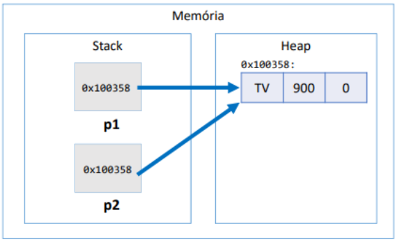

# Alocação Dinâmica de Memória

## **1. Introdução**
Em Java, a alocação dinâmica de memória é gerenciada automaticamente pela **JVM (Java Virtual Machine)**. Isso significa que, ao criar objetos, a memória necessária para armazená-los é alocada na **Heap**, enquanto as variáveis de referência são armazenadas na **Stack**. Compreender como a memória é gerenciada é crucial para evitar erros e otimizar o desempenho das aplicações.

---

## **2. Tipos Referência vs. Tipos Valor**

### **2.1 Classes como Tipos Referência**
Variáveis do tipo referência não armazenam o objeto em si, mas sim uma referência (ou endereço de memória) onde o objeto está localizado na **Heap**.

### **Exemplo:**
```java
class Product {
    String name;
    double price;
    int quantity;

    Product(String name, double price, int quantity) {
        this.name = name;
        this.price = price;
        this.quantity = quantity;
    }
}

public class TestaReferencias {
    public static void main(String[] args) {
        Product p1, p2;
        p1 = new Product("TV", 900.00, 0);
        p2 = p1; // p2 aponta para o mesmo objeto que p1

        p2.name = "Radio";

        System.out.println(p1.name); // Imprime: Radio
        System.out.println(p2.name); // Imprime: Radio
    }
}
```

### **Explicação:**
- `Product p1, p2;`: Declara duas variáveis de referência do tipo `Product`.
- `p1 = new Product(...)`: Cria um objeto `Product` na **Heap** e faz `p1` apontar para ele.
- `p2 = p1;`: Faz `p2` apontar para o mesmo objeto que `p1`.
- Alterar `p2.name` afeta `p1.name` porque ambos referenciam o mesmo objeto.

**Memória:**



### **2.2 Valor "null"**
Tipos referência podem assumir o valor `null`, indicando que a variável não está apontando para nenhum objeto.

**Exemplo:**
```java
Product p1, p2;
p1 = new Product("TV", 900.00, 0);
p2 = null;
```

**Memória:**
```
Stack         Heap
p1 ----------> 0x100358: TV 900 0
p2 ----------> null
```

### **2.3 Tipos Primitivos como Tipos Valor**
Tipos primitivos (como `int`, `double`, `boolean`, etc.) armazenam diretamente os valores.

**Exemplo:**
```java
double x, y;
x = 10;
y = x; // y recebe uma cópia do valor de x
y = 20;

System.out.println(x); // Imprime: 10
System.out.println(y); // Imprime: 20
```

**Explicação:**
- `y = x;`: Copia o valor de `x` para `y`. Modificar `y` não afeta `x`.

**Memória:**
```
Stack        Heap
x = 10
y = 20
```

### **2.4 Comparação: Tipos Referência vs. Tipos Valor**

| **Característica**           | **Classe (Tipo Referência)** | **Tipo Primitivo (Tipo Valor)**  |
|------------------------------|-----------------------------|-----------------------------------|
| **Vantagem**                 | Aproveita recursos de POO   | Simples e mais performático      |
| **Armazenamento**            | Referências                 | Valores diretamente              |
| **Instanciação**             | Requer `new`                | Não requer `new`                 |
| **Aceita valor `null`**      | Sim                         | Não                              |
| **Atribuição (=)**           | Copia a referência          | Copia o valor (independente)     |
| **Localização na Memória**   | **Heap**                    | **Stack**                        |
| **Desalocação**              | **Garbage Collector**       | Automática (fim do escopo)       |


---

## **3. Desalocação de Memória**

### **3.1 Garbage Collector**
- **Função:** Remove objetos na **Heap** que não possuem mais referências.
- **Exemplo Prático:**
```java
Product p1 = new Product("TV", 900.00, 0);
Product p2 = new Product("Mouse", 30.00, 0);

p1 = p2; // "TV" será desalocado
```

**Memória Antes:**
```
Stack         Heap
p1 ----------> "TV    900.00 0"
p2 ----------> "Mouse 30.00  0"
```

**Memória Depois:**
```
Stack         Heap
p1 ----------> "Mouse 30.00 0"
p2 ----------> "Mouse 30.00 0"
```


### **3.2 Escopo Local**
Variáveis locais são armazenadas na **Stack** e desalocadas ao final do escopo.

**Exemplo Simples:**
```java
void method1() {
    int x = 10;
    if (x > 0) {
        int y = 20;
    }
    System.out.println(x); // OK
    // System.out.println(y); // Erro
}
```

---

## **Resumo**

### **Gerenciamento de Memória em Java**
1. **Stack:**
   - Armazena variáveis locais e referências.
   - Desalocação automática ao final do escopo.
2. **Heap:**
   - Armazena objetos criados dinamicamente.
   - Desalocação automática pelo garbage collector.

**Regras Importantes:**
- Objetos no **Heap** permanecem enquanto houver referências ativas.
- Variáveis locais na **Stack** são desalocadas ao término do escopo.

### **Desafios**
1. **Por que esse código não compila?**
```java
class Teste {
    int x = 37;
    public static void main(String[] args) {
        System.out.println(x);
    }
}
```
   - R: O método `main` é estático, mas `x` não é.

2. **Correção:**
```java
class Teste {
    static int x = 37;
    public static void main(String[] args) {
        System.out.println(x);
    }
}
```

3. **Singleton em Java:**
   - Implemente o padrão **Singleton** na classe `FabricaDeCarro` para garantir que apenas um objeto seja criado.

### **Conclusão**
Compreender como o Java gerencia memória, especialmente o uso de **Stack**, **Heap** e **Garbage Collector**, é essencial para desenvolver aplicações eficientes e evitar erros comuns, como referências nulas ou vazamentos de memória.
